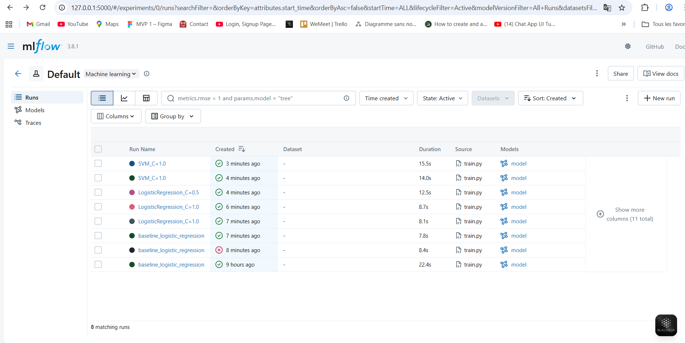
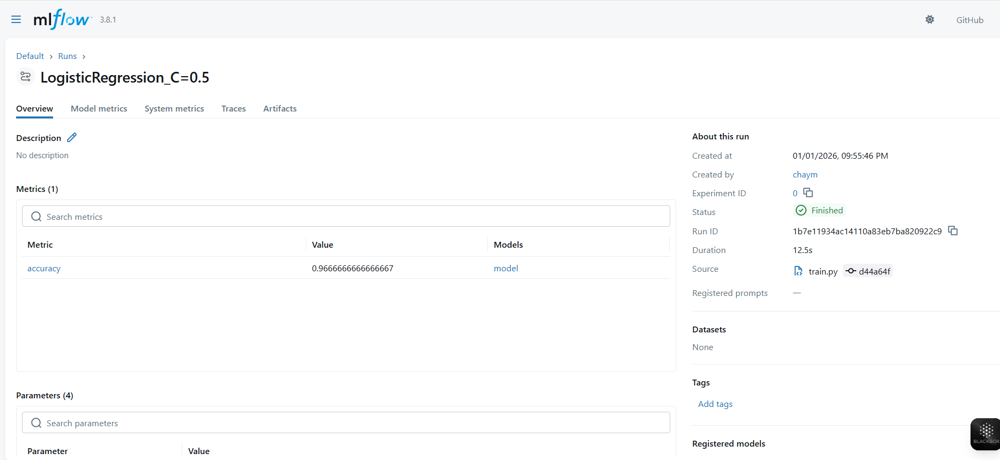
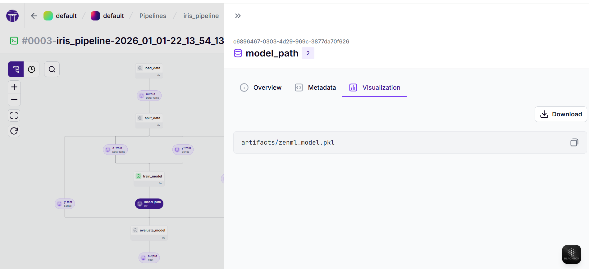
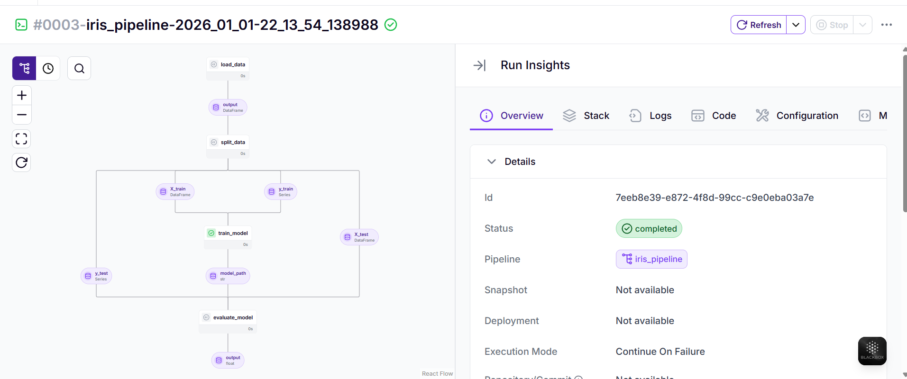
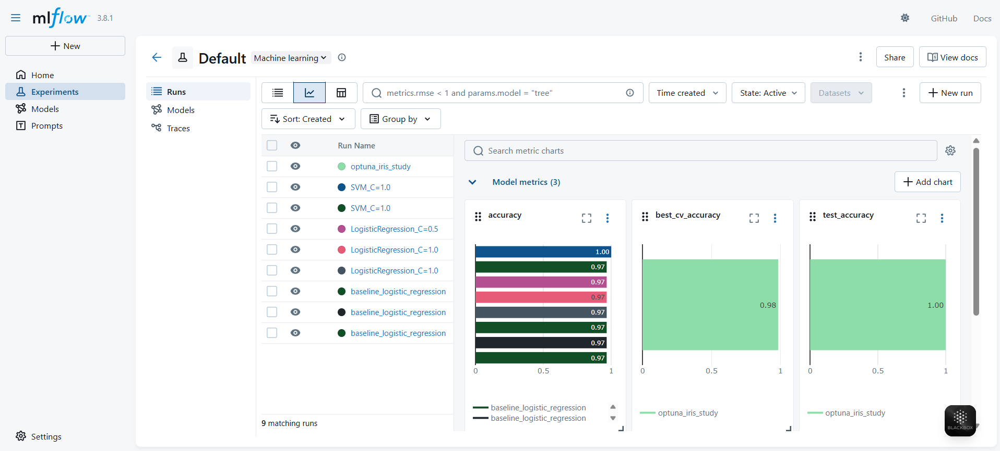
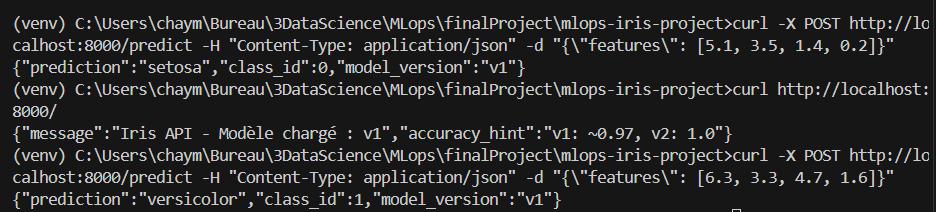
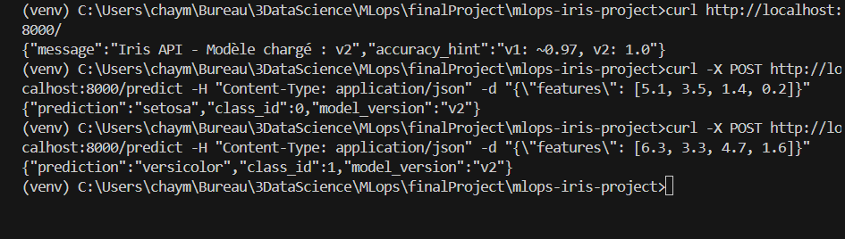
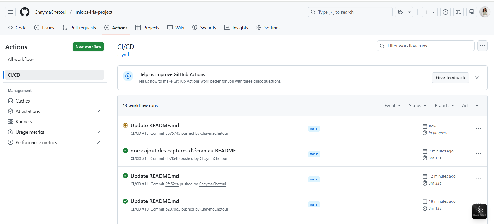

# 🌸 MLOps Iris Classification

Projet MLOps complet implémentant un workflow de bout en bout pour la classification multi-classe sur le dataset Iris, avec versioning, expérimentation, orchestration et déploiement automatisé.

[](https://github.com/ChaymaChetoui/mlops-iris-project/actions)

## 🎯 Objectifs du projet

Ce projet démontre l'implémentation d'une stack MLOps moderne comprenant :

- **Versioning** : Git (branches `dev`/`main`, tags v1/v2) + DVC (données et modèles)
- **Expérimentation** : MLflow (tracking) + Optuna (optimisation d'hyperparamètres)
- **Orchestration** : ZenML (pipeline reproductible)
- **Déploiement** : FastAPI + Docker + Docker Compose
- **CI/CD** : GitHub Actions (tests, build, déploiement)

## 📁 Structure du projet

```
mlops-iris-project/
├── .github/
│   └── workflows/
│       └── ci.yml              # CI/CD Pipeline
├── .dvc/                       # Configuration DVC
├── artifacts/                  # Modèles sauvegardés
│   ├── model_v1.pkl           # Baseline LogisticRegression
│   ├── model_v2.pkl           # Meilleur modèle (SVM, acc: 1.0)
│   └── optuna_best_model_final.pkl
├── data/
│   └── iris.csv               # Dataset (versionné avec DVC)
├── src/
│   ├── app.py                 # API FastAPI
│   ├── optuna_study.py        # Optimisation hyperparamètres
│   ├── pipeline.py            # Pipeline ZenML
│   ├── prepare_data.py        # Préparation des données
│   └── train.py               # Entraînement des modèles
├── tests/
│   └── test_model.py          # Tests unitaires
├── .gitignore
├── Dockerfile
├── docker-compose.yml
├── requirements.txt
└── README.md
```

## 🚀 Installation et démarrage

### Prérequis

- Python 3.10
- Docker & Docker Compose
- Git & DVC

### 1. Cloner le projet

```bash
git clone https://github.com/ChaymaChetoui/mlops-iris-project.git
cd mlops-iris-project
```

### 2. Récupérer les données

```bash
dvc pull  # Télécharge iris.csv depuis le remote DVC
```

### 3. Configurer l'environnement

```bash
# Créer l'environnement virtuel
python -m venv venv

# Activer l'environnement
source venv/bin/activate  # Linux/Mac
# ou
venv\Scripts\activate     # Windows

# Installer les dépendances
pip install -r requirements.txt
```

## 🔬 Expérimentation et entraînement

### Suivi avec MLflow

Lancez l'interface MLflow pour visualiser toutes les expériences :

```bash
mlflow ui
```

Accédez à http://localhost:5000 pour voir :

- ✅ Run baseline (LogisticRegression)
- ✅ Variations manuelles (différents hyperparamètres)
- ✅ Étude Optuna (10 trials avec child runs)
- ✅ Meilleur modèle (SVM, accuracy: 1.0)




*Interface MLflow montrant l'historique des expériences et les métriques*

### Pipeline ZenML

Exécutez le pipeline complet de ML :

```bash
python src/pipeline.py
zenml up --blocking
```

Accédez à http://localhost:8237 pour visualiser :

**DAG du pipeline** : `load_data` → `split_data` → `train_model` → `evaluate_model`




*Pipeline ZenML avec les différentes étapes et artefacts*

Les artefacts sont automatiquement sauvegardés dans `artifacts/`.

### Optimisation avec Optuna

Lancez une étude d'optimisation des hyperparamètres :

```bash
python src/optuna_study.py
```

Cette étude :
- Teste 10 combinaisons d'hyperparamètres
- Logs tous les trials dans MLflow (parent + child runs)
- Sauvegarde automatiquement le meilleur modèle


*Résultats de l'optimisation Optuna avec les meilleurs hyperparamètres*

## 🌐 Déploiement de l'API

### Lancer l'API avec Docker Compose

```bash
docker-compose up --build
```

L'API est accessible sur http://localhost:8000





### Tester les prédictions

**Page d'accueil** :
```bash
curl http://localhost:8000/
```

**Prédire une espèce Iris** :

```bash
# Setosa
curl -X POST http://localhost:8000/predict \
  -H "Content-Type: application/json" \
  -d '{"features": [5.1, 3.5, 1.4, 0.2]}'

# Versicolor
curl -X POST http://localhost:8000/predict \
  -H "Content-Type: application/json" \
  -d '{"features": [6.3, 3.3, 4.7, 1.6]}'

# Virginica
curl -X POST http://localhost:8000/predict \
  -H "Content-Type: application/json" \
  -d '{"features": [6.7, 3.0, 5.2, 2.3]}'
```

### Gestion des versions de modèle

Pour changer de version, modifiez `MODEL_VERSION` dans `docker-compose.yml` :

- `v1` : Modèle baseline (LogisticRegression)
- `v2` : Meilleur modèle Optuna (SVM, accuracy: 1.0)

```yaml
environment:
  - MODEL_VERSION=v2  # Changer ici
```

Puis relancez :

```bash
docker-compose up --build
```

**Stratégie de déploiement testée** :
1. ✅ Déploiement initial avec v1
2. ✅ Migration vers v2 (meilleur modèle)
3. ✅ Rollback vers v1 (si nécessaire)
## 🌐 Déploiement live avec interface web interactive

Le projet est déployé en live sur AWS EC2 avec une interface Gradio interactive permettant de tester les prédictions en temps réel.

### URL fixe pour tester l'interface (Elastic IP)
**Interface Gradio live :**  
http://34.193.10.232:7860/

**Instructions pour tester :**
1. Ouvrez le lien ci-dessus dans votre navigateur
2. Déplacez les curseurs pour entrer les mesures de la fleur Iris
3. Cliquez sur **Submit**
4. Vous verrez la prédiction instantanée (setosa, versicolor ou virginica) 🌸

**Exemples rapides à tester :**
- Setosa : [5.1, 3.5, 1.4, 0.2]
- Versicolor : [6.4, 3.2, 4.5, 1.5]
- Virginica : [7.7, 3.8, 6.7, 2.2]

**Note :**  
L'URL est fixe grâce à une Elastic IP AWS. L'instance doit être en cours d'exécution et `python app.py` lancé sur le serveur pour que l'interface soit accessible.


## 🔄 CI/CD avec GitHub Actions

Le workflow `.github/workflows/ci.yml` s'exécute automatiquement à chaque push sur `dev` ou `main` :

### Pipeline CI/CD

1. **Linting** : Vérification du code avec `flake8`
2. **Tests unitaires** : Exécution de `pytest`
3. **Build Docker** : Construction de l'image
4. **Push Registry** : Publication sur GitHub Container Registry (`ghcr.io`)
5. **Smoke test** : Validation quotidienne automatique


*Workflow CI/CD avec tous les jobs réussis*

Consultez l'onglet [Actions](https://github.com/ChaymaChetoui/mlops-iris-project/actions) pour voir l'historique des builds.

## 📊 Résultats

| Modèle | Accuracy | Hyperparamètres | Version |
|--------|----------|-----------------|---------|
| LogisticRegression (baseline) | 0.97 | C=1.0 | v1 |
| **SVM (Optuna)** | **1.00** | **C=10, kernel=rbf** | **v2** |

## 🧪 Tests

Lancer les tests unitaires :

```bash
pytest tests/
```

## 📝 Commandes utiles

```bash
# DVC
dvc add data/iris.csv          # Versionner un fichier
dvc push                       # Pousser vers le remote
dvc pull                       # Récupérer depuis le remote

# Git
git checkout dev               # Basculer sur dev
git tag v1                     # Créer un tag

# Docker
docker-compose logs -f         # Voir les logs en temps réel
docker-compose down            # Arrêter les conteneurs

# ZenML
zenml stack list               # Lister les stacks
zenml pipeline runs list       # Historique des runs
```

## 🛠️ Technologies utilisées

- **ML/Data** : scikit-learn, pandas, numpy
- **MLOps** : MLflow, ZenML, DVC, Optuna
- **API** : FastAPI, uvicorn
- **Containerisation** : Docker, Docker Compose
- **CI/CD** : GitHub Actions
- **Versioning** : Git, DVC

## 🤝 Contribution

Les contributions sont les bienvenues ! N'hésitez pas à ouvrir une issue ou une pull request.

## 📄 Licence

Ce projet est sous licence MIT.

## 👤 Auteur

**Chayma Chetoui**

- GitHub: [@ChaymaChetoui](https://github.com/ChaymaChetoui)

---

⭐ Si ce projet vous a aidé, n'hésitez pas à lui donner une étoile !
